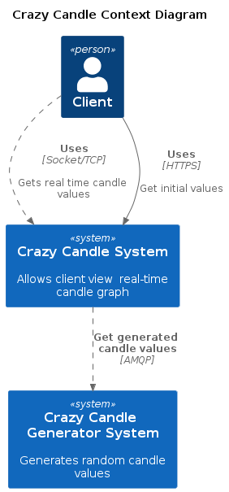
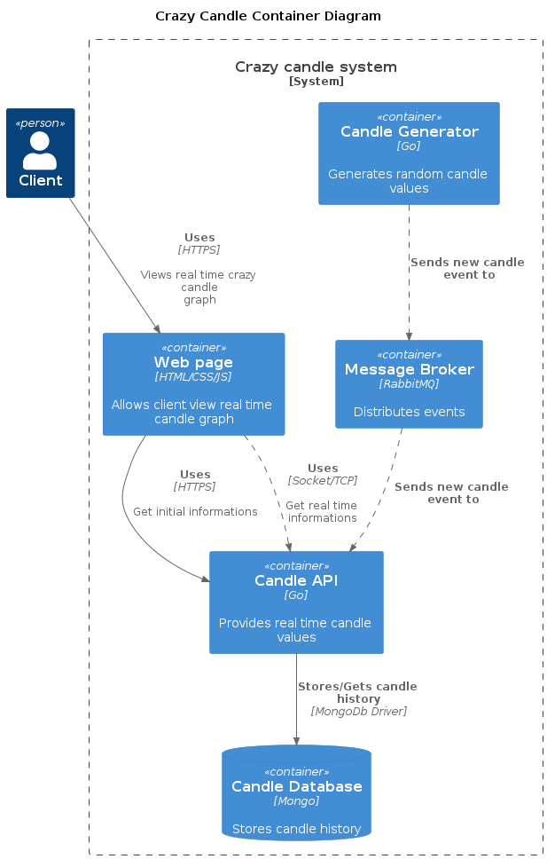

# Crazy Candle Simulator

This application simulates the real-time visualization of the variation of a fictitious currency (crazy coin) through the candle chart.
The project was developed in order to try some features like `RabbitMQ`, `MongoDb` and `Websocket` using the `Go` language.

<p align="center">
    
</p>

## C4 Model diagrams

### Context Layer

<p align="center">
    
</p>

### Container Layer

<p align="center">
    
</p>


## How to play with it?

In your terminal run:

```
docker compose up
```

Now, in your browser access the application through the url `http://localhost:80`, or just `http://localhost`

The following accesses are also available:

**RabbitMq Manager** via the url `http://localhost:15672/`, using guest/guest credentials

**MongoDb Express** via the url `http://localhost:8081/`
